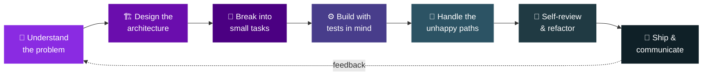

<div align="center">


<br/>

<a href="https://www.linkedin.com/in/saravanan-v-76b762331"></a>
<a href="mailto:your-email@example.com"></a>


<br/><br/>


</div>

<br/>


<br/>

## 👋 About Me

<table>
<tr>
<td width="60%" valign="top">

I'm a **Mobile Application Developer** with ~1.8 years of hands-on experience building production-ready apps in **Flutter**. I care less about writing code that *just works* and more about writing code that **survives contact with real users, real edge cases, and the next developer who reads it** — which is usually future me.

I'm currently working at **Alabtechnology**, building and shipping Flutter applications end-to-end — from architecture decisions to the pixel-level polish that makes an app feel finished.

```yaml
me:
  role: Mobile Application Developer
  focus: Flutter · Dart · Clean Architecture
  experience: 1.8+ years
  currently_at: Alabtechnology
  based_in: Chennai, India
  mindset: "ship it clean, or don't ship it"
```

- 🔭 Currently focused on **Flutter + Firebase** apps with clean, scalable architecture
- 🌱 Deepening my knowledge of **state management, offline-first design & API patterns**
- 💬 Ask me about **Flutter, Dart, SQLite, Firebase, or Clean Architecture**
- ⚡ Fun fact: I'd rather lose an hour refactoring than ship something I'll regret in review

</td>
<td width="40%" valign="top" align="center">


</td>
</tr>
</table>

<br/>

## 🛠️ How I Work

<div align="center">

*This is the part most profiles skip — but it's the part that actually matters when you work with someone.*

</div>

<br/>

<div align="center">



</div>

<br/>

<table>
<tr>
<td width="50%" valign="top">

### 🧭 Structure before screens
Before writing a single widget, I map the architecture — usually **Clean Architecture** with clear data/domain/presentation layers. Costs more time on day one, saves days later.

</td>
<td width="50%" valign="top">

### 🧩 Small, reviewable pieces
Every feature gets decomposed into small, testable commits. I'd rather ship five focused PRs than one 800-line *"trust me, it works."*

</td>
</tr>
<tr>
<td width="50%" valign="top">

### 🔁 Design for the unhappy path
Offline states, error states, empty states — designed from day one, not patched in after QA finds them.

</td>
<td width="50%" valign="top">

### 🧪 Testing is part of the feature
I don't call something "done" until I've actively tried to break it myself — not just run the happy path once.

</td>
</tr>
<tr>
<td width="50%" valign="top">

### 📚 I document decisions, not just code
Clear commit messages and comments so the *why* survives — for teammates, and for future me.

</td>
<td width="50%" valign="top">

### 🗣️ Blockers get flagged early
I'd rather raise a risk on day one of a sprint than surprise everyone on the last day.

</td>
</tr>
<tr>
<td width="50%" valign="top">

### ♻️ Refactor as I go
If I touch a file and see a clear improvement, I make it — small deliberate cleanups over a "someday" rewrite.

</td>
<td width="50%" valign="top">

### 🎯 Built for real conditions
A feature that looks great in a demo but breaks on a slow network or old device isn't finished yet.

</td>
</tr>
</table>

<br/>

## 🧰 Tech Stack

<div align="center">


<br/><br/>


</div>

<br/>

<div align="center">

> *"Code is read far more often than it's written — so I write for the reader, not just the compiler."*

</div>

<br/>


## 🚀 Featured Projects

<table>
<tr>
<td width="50%" valign="top">

### 📝 [flutter_todo_app](https://github.com/vsaravananc/flutter_todo_app)
**Do-it** — a fast, lightweight, beautifully designed Todo app.

- 📴 Offline-first with **SQLite** local storage
- 🎨 Smooth UI interactions and intuitive UX
- ⚡ Built for speed — no lag, no clutter

`Flutter` `Dart` `SQLite`

</td>
<td width="50%" valign="top">

### 🍳 [flutter-recipe-app](https://github.com/vsaravananc/flutter-recipe-app)
A feature-rich Recipe Book app built with **Clean Architecture**.

- 🔐 Firebase authentication
- 🍽️ Live recipes via **TheMealDB API**
- 💾 Local caching with **Sqflite**
- ⭐ Personalized recommendations

`Flutter` `Firebase` `Sqflite` `Clean Architecture`

</td>
</tr>
</table>

<br/>


## 📊 GitHub Stats

<div align="center">


<br/>


</div>

<br/>

## 🐍 Contribution Snake

<div align="center">


<sub>⚙️ This animates automatically once the <b>snake GitHub Action</b> is set up (instructions below) — it eats your contribution graph.</sub>

</div>

<br/>

## 📫 Let's Connect

<div align="center">

I'm always open to interesting Flutter projects, collaborations, or just talking shop about clean architecture and mobile UX.

<a href="https://www.linkedin.com/in/saravanan-v-76b762331">
  
</a>

<br/><br/>


</div>
